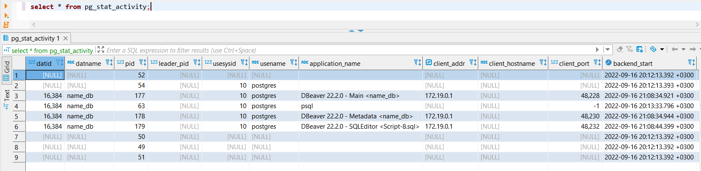

### 1. Соединиться с сервером PostgreSQL
1. Поднимаем контейнер с PostgreSQL в фоне
```bash
docker-compose up -d --build
```

2. Подключаемся к серверу PostgreSQL
```bash
docker-compose exec db psql -U postgres
```

### 2. Создать новую базу данных
- \l - список баз данных
- \c name_db - подключение к базе данных

1. Набираем в консоли postgres следующую команду
```sql
CREATE DATABASE name_db;
```
2. Подключаемся к базе данных
```sql
\c name_db;
```

### 3. Создать новую таблицу customer, item. Заполнить таблицы 2 записями.
- \d - список таблиц
- \dt имя_таблицы - информация о таблице

1. Создаем таблицу customer
```sql
CREATE TABLE customer (
	customer_id SERIAL,
	title VARCHAR(4),
	first_name VARCHAR(50) NOT NULL,
	last_name VARCHAR(50) NOT NULL,
	addessline VARCHAR(50),
	town VARCHAR(50),
	zipcode VARCHAR(10),
	phone VARCHAR(16),
	constraint customer_pk primary key (customer_id)
);
```

2. Создаем таблицу item
```sql
CREATE TABLE item (
	item_id SERIAL,
	descr VARCHAR(50) NOT NULL,
	sell_price NUMERIC(10,2),
	cost_price NUMERIC(10,2),
	constraint item_pk primary key (item_id)
);
```

3. Смотрим на созданные таблицы
```sql
\d
```
```console
                    List of relations
 Schema |           Name           |   Type   |  Owner   
--------+--------------------------+----------+----------
 public | customer                 | table    | postgres 
 public | customer_customer_id_seq | sequence | postgres 
 public | item                     | table    | postgres 
 public | item_item_id_seq         | sequence | postgres
(4 rows)
```

4. Заполняем таблицу customer
```sql
INSERT INTO customer (title, first_name, last_name, addessline, town, zipcode, phone) VALUES ('Mr.', 'John', 'Smith', '1 Main Street', 'London', 'W1 1AA', '01234 567890'), ('Mrs.', 'Jane', 'Doe', '2 High Street', 'Bristol', 'BS2 2BB', '02345 678901');
```

5. Заполняем таблицу item
```sql
INSERT INTO item (descr, sell_price, cost_price) VALUES ('Widget', 10.00, 5.00), ('Gadget', 20.00, 10.00), ('Inspector', 30.00, 15.00);
```

6. Смотрим на содержимое заполненных таблиц
```sql
select * from item JOIN customer on item_id = customer_id;
```
```console
item_id | descr  | sell_price | cost_price | customer_id | title | first_name | last_name |  addessline   |  town   | zipcode |    phone     
---------+--------+------------+------------+-------------+-------+------------+-----------+---------------+---------+---------+--------------
       1 | Widget |      10.00 |       5.00 |           1 | Mr.   | John       | Smith     | 1 Main Street | London  | W1 1AA  | 01234 567890
       2 | Gadget |      20.00 |      10.00 |           2 | Mrs.  | Jane       | Doe       | 2 High Street | Bristol | BS2 2BB | 02345 678901
(2 rows)
```

### 4. Создать 2 группы пользователей: admin и users
- \du - список пользователей

1. Создаем группу пользователей admin
```sql
CREATE GROUP admin;
```

2. Создаем группу пользователей users
```sql
CREATE GROUP users;
```

3. Смотрим на созданные группы пользователей
```sql
\du
```
```console
                                  List of roles
 Role name |                         Attributes                         | Member of
-----------+------------------------------------------------------------+-----------
 admin     | Cannot login                                               | {}
 postgres  | Superuser, Create role, Create DB, Replication, Bypass RLS | {}
 users     | Cannot login                                               | {}
(3 rows)
```

### 5. Создать пользователей внутри группы admin и users
- \du - список пользователей

1. Создаем пользователя admin внутри группы admin
```sql
CREATE USER admin2 WITH PASSWORD 'admin' IN GROUP admin;
```

2. Смотрим на результат
```sql
\du
```
```console
                                   List of roles
 Role name |                         Attributes                         | Member of
-----------+------------------------------------------------------------+-----------
 admin     | Cannot login                                               | {}
 admin2    |                                                            | {admin}
 postgres  | Superuser, Create role, Create DB, Replication, Bypass RLS | {}
 users     | Cannot login                                               | {}
```

3. Создаем пользователя user внутри группы users
```sql
CREATE USER user WITH PASSWORD 'user' IN GROUP users;
```

4. Смотрим на результат
```sql
\du
```
```console
                                   List of roles
 Role name |                         Attributes                         | Member of
-----------+------------------------------------------------------------+-----------
 admin     | Cannot login                                               | {}
 admin2    |                                                            | {admin}
 postgres  | Superuser, Create role, Create DB, Replication, Bypass RLS | {}
 user1     |                                                            | {users}
 users     | Cannot login                                               | {}
```

### 6. Дать пользователям привелегии на таблицы
- \du - список пользователей

1. Даем привелегии на таблицы группе admin
```sql
GRANT ALL ON customer TO admin;
GRANT ALL ON item TO admin;
```

2. Даем привелегии на таблицы группе users
```sql
GRANT SELECT ON customer TO user1;
GRANT SELECT ON item TO user1;
```

3. Узнать права пользователя на таблицу
```sql
\z customer
```
```console
                                  Access privileges
 Schema |   Name   | Type  |     Access privileges     | Column privileges | Policies
--------+----------+-------+---------------------------+-------------------+----------
 public | customer | table | postgres=arwdDxt/postgres+|                   |
        |          |       | admin=arwdDxt/postgres   +|                   |
        |          |       | user1=r/postgres          |                   |
```

### 7. Отключить пользователя user1, снять с него привелегии

1. Отключаем пользователя user1
```sql
REVOKE CONNECT ON DATABASE postgres FROM users;
```

2. Снимаем привелегии с пользователя user1
```sql
REVOKE ALL ON customer FROM user1;
REVOKE ALL ON item FROM user1;
```

3. Узнать права пользователя на таблицу customer
```sql
\z customer
```
```console
                                  Access privileges
 Schema |   Name   | Type  |     Access privileges     | Column privileges | Policies
--------+----------+-------+---------------------------+-------------------+----------
 public | customer | table | postgres=arwdDxt/postgres+|                   |
        |          |       | admin=arwdDxt/postgres    |                   |
```

4. Запретить пользователю логинться
```sql
ALTER USER user1 NOLOGIN;
```

5. Запретить пользователю делать подключение
```sql
ALTER USER user1 CONNECTION LIMIT 0;
```

6. Посмотреть права пользователя user1
```sql
\du
```
```console
                                   List of roles
 Role name |                         Attributes                         | Member of
-----------+------------------------------------------------------------+-----------
 admin     | Cannot login                                               | {}
 admin2    |                                                            | {admin}
 postgres  | Superuser, Create role, Create DB, Replication, Bypass RLS | {}
 user1     | Cannot login                                              +| {users}
           | No connections                                             |
 users     | Cannot login                                               | {}
```

7. Посмотреть серверные процессы
```sql
SELECT * FROM pg_stat_activity;
```


8. завершить процесс с pid=1234 (к примеру)
```sql
SELECT pg_terminate_backend(1234);
```

### 8. Скопировать данные из таблицы в текстовый файл и обратно

1. Скопировать данные из таблицы в текстовый файл
```sql
COPY customer TO '/temp_folder/customer.txt';
```

2. Скопировать данные из текстового файла в таблицу
```sql
DELETE FROM customer;
COPY customer FROM '/temp_folder/customer.txt';
```

9. Создать скрипты на создание таблиц БД, заполнение и удаление. Запустить скрипты.

1. Запустить скрипт из файла
```sql
\i /temp_folder/customer.sql
\i /temp_folder/item.sql
```

10. Создать перечислимый тип job_title 

1. Создать перечислимый тип job_title
```sql
CREATE TYPE job_title AS ENUM ('manager', 'developer', 'tester');
```

2. Посмотреть типы
```sql
\dT+
```
```console
                                         List of data types
 Schema |   Name    | Internal name | Size | Elements  |  Owner   | Access privileges | Description
--------+-----------+---------------+------+-----------+----------+-------------------+-------------
 public | job_title | job_title     | 4    | manager  +| postgres |                   |
        |           |               |      | developer+|          |                   |
        |           |               |      | tester    |          |                   |
```

### 11. Создать таблицу сотрудников employee с указанием их дней работы с полями: employee_id serial, first_name text, last_name text, workdays integer[], job_title job_title, salary numeric(7, 2)

1. Создать таблицу employee
```sql
CREATE TABLE employee (
	employee_id SERIAL,
	first_name TEXT,
	last_name TEXT,
	workdays INTEGER[],
	job_title job_title,
	salary NUMERIC(7, 2)
);
```
workdays - массив дней работы в неделю, где 1 - в этот день работает, 0 в этот день не работает.

### 12. Внести данные в таблицу employee

1. Внести данные в таблицу employee
```sql
INSERT INTO employee (first_name, last_name, workdays, job_title, salary)
VALUES ('Ivan', 'Ivanov', '{1, 1, 1, 1, 1, 0, 0}', 'manager', 10000.00),
	   ('Petr', 'Petrov', '{1, 1, 1, 1, 1, 0, 0}', 'developer', 8000.00),
	   ('Sidor', 'Sidorov', '{1, 1, 1, 1, 1, 0, 0}', 'tester', 6000.00);
```

2. Посмотреть данные в таблице employee
```sql
SELECT * FROM employee;
```
```console
employee_id | first_name | last_name |    workdays     | job_title |  salary  
-------------+------------+-----------+-----------------+-----------+----------
           1 | Ivan       | Ivanov    | {1,0,1,1,1,0,0} | manager   | 10000.00 
           2 | Petr       | Petrov    | {1,1,0,1,1,0,0} | developer |  8000.00
           3 | Sidor      | Sidorov   | {1,1,1,1,1,0,1} | tester    |  6000.00
```